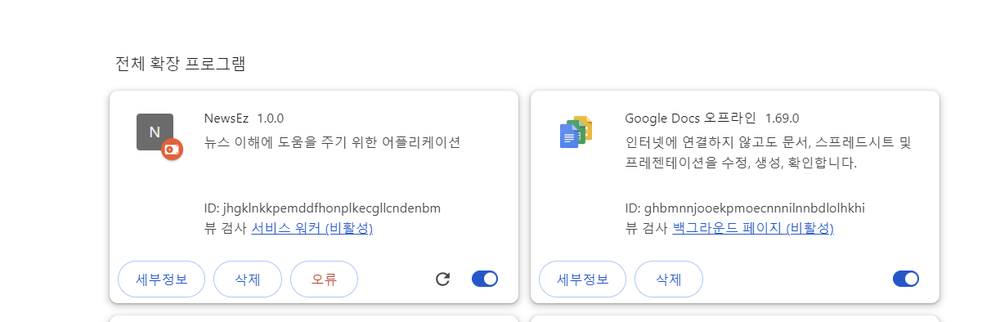
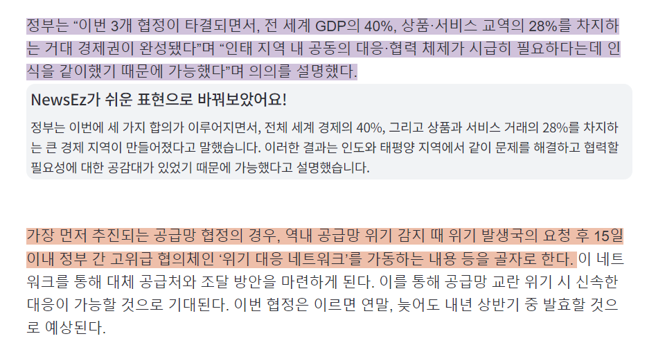
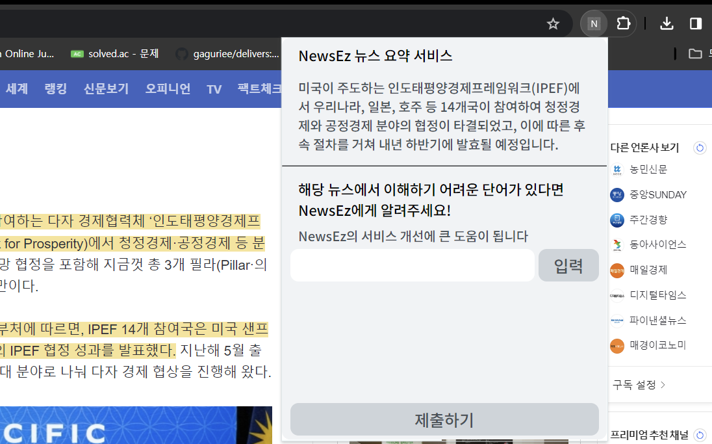

# NewsEz - Chrome Extension Application

뉴스 기사의 쉬운 이해를 돕기 위한 크롬 확장 프로그램

## 📖 프로젝트 동기

### 1. 현 뉴스 제공 방식의 문제점

● 현대 뉴스 플랫폼에서 다음과 같은 문제는 일반 대중들이 기사를 이해하고 접근하는 것을 어렵게 만들며, 이는 뉴스를 기피하게 되는 요인이 됨.

### 2. 문제점 해결을 위한 개발 동기
● 배경지식이 없는 사람들도 뉴스를 쉽게 이해할 수 있도록 독자의 이해도차이를 고려하여 뉴스에 대한 접근성과 이해도를 높일 수 있는 서비스를 제공하고자 함
 
● 이를 위해 어려운 정보를 쉬운 표현으로 변환하고, 핵심 문장을
시각화하는 서비스를 계획하게 되었음

 

## 🔨기술 스택

 

## 🔍 구현 기능

### 1. 문장 하이라이트 
<li> 사용자가 네이버 뉴스에 접속하면, 현재 뉴스의 URL을 플라스크 서버에 전달함. 이를 통해 서버는 해당 뉴스 기사에 대한 데이터를 처리하고, 어려운 문장, 핵심 문장, 뉴스 요약 데이터를 클라이언트에게 전달
<li> Content Script에서 받은 데이터를 기반으로 웹페이지의 DOM을 조작합니다. 세 가지 유형의 문장 - 어려운 문장, 핵심 문장, 어려운 핵심 문장 - 에 대해 하이라이트를 구현
<li> 하이라이트 완료시 chrome.notifications API를 사용해 알림메세지 표시

 

### 2. 어려운 문장 클릭 시 쉬운 문장 창 띄우기
<li> 하이라이트된 어려운 문장에 클릭 이벤트를 추가해 어려운 문장을 클릭하면, 해당 문장의 쉬운 표현을 보여주는 팝업 창을 생성

 

### 3. 크롬 익스텐션 팝업
<li> 크롬 익스텐션 버튼을 클릭하면, 뉴스 요약 정보, 어려운 단어 입력창으로 구성된 팝업창 생성
<li> 서버에서 데이터를 받아오기 전엔 로딩 상태를 나타내는 스피너와 함께 "NewsEz 작동중..." 메시지가 표시됨. 작동이 완료되면 뉴스 요약 정보가 표시됨

## manifest.json
<pre><code>
{
  "name": "NewsEz",
  "description": "뉴스 이해에 도움을 주기 위한 어플리케이션", 
  "manifest_version": 3, 
  "version": "1.0.0", 
  "background": { 
    "service_worker": "background.js" // 백그라운드에서 실행되는 스크립트 파일
  },

  "permissions": [ 
    "https://n.news.naver.com/*", // 네이버 뉴스 사이트에 접근할 수 있는 권한을 부여
    "storage", // chrome.storage API를 사용할 수 있는 권한부여
    "activeTab", // 현재 활성화된 탭에 접근할 수 있는 권한부여
    "scripting", // 스크립트를 실행하거나 코드를 주입할 수 있는 권한 부여
    "tabs", // 탭에 대한 다양한 정보를 액세스하거나 조작할 수 있는 권한부여
    "notifications" // 알림 생성을 위한 권한 부여
  ],

  "action": {
    "default_popup": "index.html" // 익스텐션 아이콘 클릭 시 표시되는 팝업 설정
  },
  
  "content_scripts": [ 
    {
      "matches": ["https://n.news.naver.com/*"], // 컨텐트 스크립트가 동작할 페이지의 URL 패턴 지정
      "js": ["Content.js"] // 해당 페이지에서 실행될 자바스크립트 파일 지정
    }
  ]
}

</code></pre>

## 🧑🏻‍💻 Contributor
|  |  
|:---:|:---:
이은지|이준서

 

